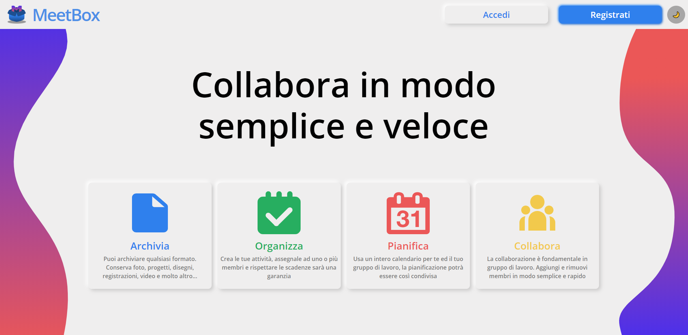
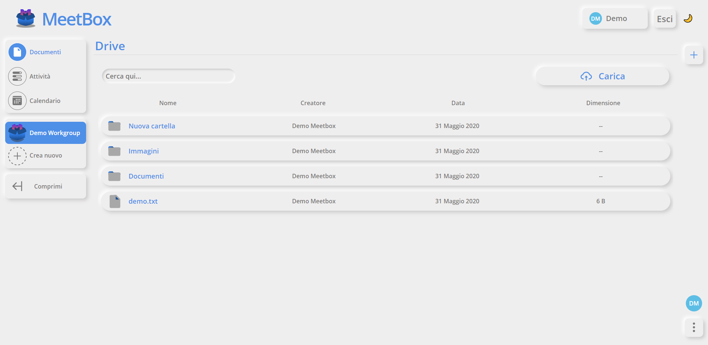
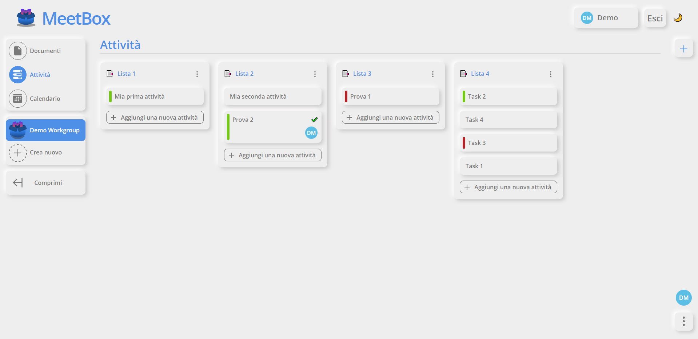
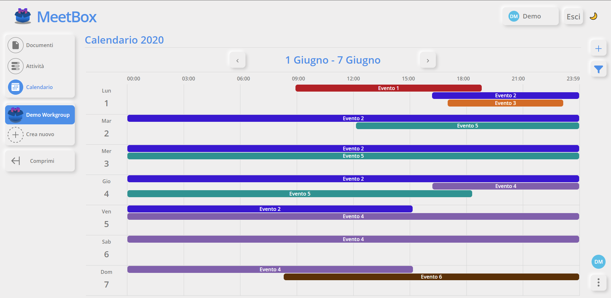

# MeetBox Client

Progetto realizzato per il corso di Linguaggi e tecnologie per il web.

## Cos'è MeetBox?
MeetBox è una piattaforma che mette in collaborazione persone diverse, attraverso la condivisione di documenti, attività ed eventi.
Appena entrato in MeetBox dovrai creare il tuo primo gruppo di lavoro con un nome ed un'immagine. MeetBox ti metterà quindi a disposizione un drive dove potrai condividere file, una ["kanban board"](https://en.wikipedia.org/wiki/Kanban_board) dove potrai organizzare le tue attività e un calendario dove gestire i tuoi eventi.

## Prova MeetBox
Per provare MeetBox collegati subito a https://meet-box.herokuapp.com/.

Usa le seguenti credenziali per accedere tramite un account di prova:

- 📧 meetbox@example.com
- 🔑 demo

:warning: Ricordati però che ogni modifica che effettui tramite l'account di prova viene salvata. :warning:

## Funzionalità in breve
### 📂 Documenti
Nella sezione documenti puoi creare ed eliminare cartelle, caricare ed eliminare documenti, spostare, rinominare cartelle o documenti e selezionare i membri con i quali condividere un certo documento.

### 📝 Attività
Nella sezione delle attività puoi creare, rinominare, spostare ed eliminare una sezione o un task, inoltre puoi aggiungere un'etichetta, una descrizione, una data di scadenza oppure una serie di allegati al task, infine puoi selezionare i membri al quale assegnare il task.

### 📅 Calendario
Nella sezione del calendario puoi creare, spostare, modificare e cancellare eventi (anche tramite rapide shortcut), filtrare eventi oppure aggiungere una descrizione e quali sono i partecipanti dell'evento.

